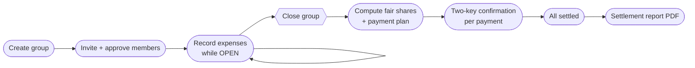
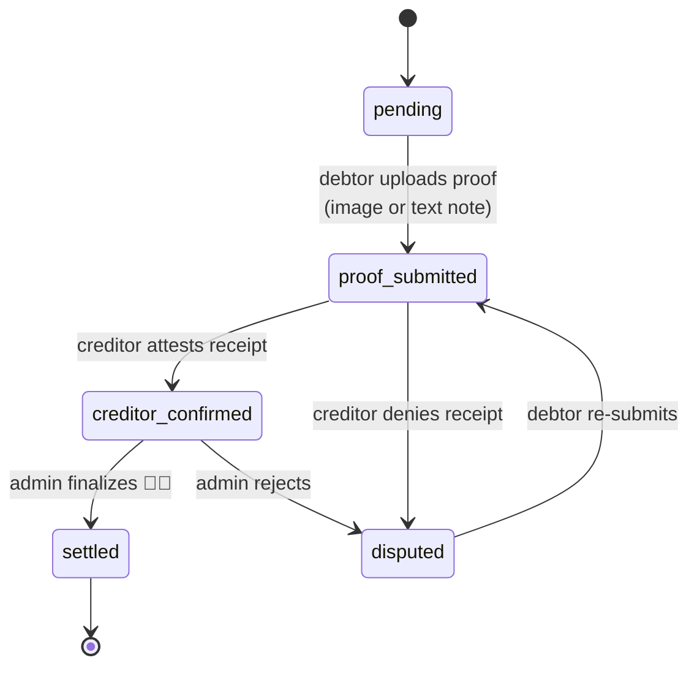

<div align="center">

# 💸 Expense Splitter

### Settle the group-trip bill without the group-chat argument.

*Members log what they paid along the way. At settlement, the system computes each person's fair share, works out the **minimum set of payments** that makes everyone whole, and tracks every real-world payment through an evidence-backed, tamper-proof confirmation flow.*

<br>


</div>

---

## 🧭 The problem

Group trips break for one reason: **nobody pays equally as they go.**

One friend books the hotel, another keeps filling the tank, a third covers every lunch — and by the last day the group chat is a forensic-accounting thread of receipts and *"wait, who paid for the second night?"* One person with a calculator gets it wrong, and everybody argues.

This backend ends that argument. It does the math correctly, tells everyone the **fewest payments** needed to square up, and then makes sure each of those payments actually happened — with proof, not vibes.

> 💡 **It holds no money and touches no payment provider.** Debtors pay their creditors **in real life** (cash or a personal bank transfer) and upload evidence. The system's job is *correct math* and *trustworthy confirmation* — nothing flows through it.

---

## ✨ A day in the life

> **Ahmed, Omar, and Mohammed** take a weekend trip to Nizwa.

| Step | What happens |
|:--:|---|
| 🧳 | **Ahmed creates the trip** "Nizwa Weekend" and becomes its *group-admin*. He shares an invite token. |
| 🙋 | **Omar and Mohammed request to join**; Ahmed approves them. Now the group has 3 members. |
| 🧾 | Over the weekend they **log expenses as they pay**: Ahmed pays 100 for the hotel, Omar pays 80 for fuel & food, Mohammed pays nothing. Total = **180**. |
| 🔒 | Back home, Ahmed **closes the group**. Settlement freezes and computes. |
| ➗ | Fair share = `180 / 3 = 60` each. Net balances → Ahmed **+40**, Omar **+20**, Mohammed **−60**. |
| 🎯 | The plan is the **minimum** set of transfers: **Mohammed → Ahmed 40** and **Mohammed → Omar 20**. Two payments, everyone even. |
| 📸 | Mohammed pays them in cash and **uploads a photo of the transfer** as proof. |
| ✅ | Ahmed and Omar each **confirm they received it**; Ahmed (admin) **finalizes**. Only now are the payments marked **settled**. |
| 📄 | Once every payment is settled, anyone can pull the **settlement report PDF**. |

That whole flow is exercised end-to-end, with assertions, by `make test-e2e`.

---

## 🎨 What makes it interesting

- **🎯 Optimal-ish settlement** — a greedy *largest-debtor ↔ largest-creditor* algorithm that guarantees **≤ N−1 transfers** instead of the naive N×(N−1). ([details ↓](#-the-settlement-algorithm))
- **🪙 Exact-baisa money** — every amount is an integer minor unit (`1.000 OMR = 1000`). **Zero floats** anywhere in the money path; the remainder is distributed deterministically so the same input always yields the same plan.
- **🔐 Two-key confirmation** — a payment can only reach `settled` when the **debtor proves**, the **creditor attests**, and an **admin finalizes**. No single party can fake a settlement. ([state machine ↓](#-the-two-key-confirmation-state-machine))
- **🛡️ Provably tamper-resistant** — the confirmation state machine is verified by *enumerating the entire (role × action × status) space*, not just happy paths.
- **🧬 Evidence integrity** — proof images live in MinIO; the DB stores a **sha256** and validates uploads by **magic bytes**, so a renamed or swapped file is detectable.
- **👥 Per-group roles** — you can be *group-admin of Trip A* and a *plain member of Trip B* at the same time. One global admin sits above everything.
- **📜 Full audit trail** — every expense edit records **before/after**, every role change and payment transition is logged and paginated.
- **🔀 Race-proof settlement** — row-level locks + a `UNIQUE` backstop guarantee a group settles **exactly once** over a consistent snapshot. ([locking ↓](#-concurrency--locking))

---

## 👤 Roles at a glance

| Role | Scope | Can do |
|---|---|---|
| **Global Admin** | Whole system | Manage & verify all users, view everything, override-finalize/reject any payment, create groups on behalf of others. Holds group-admin powers in **every** group implicitly — no membership row required. |
| **Group-Admin** | One group | Set trip metadata, approve/reject join requests, close the group, transfer their role, finalize payments in **their** group. |
| **Member** | One group | Record expenses **they paid**, edit/delete **their own** while open, upload proof for what they **owe**, confirm receipt for what they're **owed**, view results. |

> A user must be **verified** (`registered → pending_verification → verified`) before they can join a group, record expenses, or be settled against.

---

## 🔄 Trip lifecycle



## 🔐 The two-key confirmation state machine

Every computed payment is tracked — off-platform money, on-platform trust.



**Two keys are mandatory:** the *only* path to `creditor_confirmed` is the creditor's confirm, and the *only* path to `settled` is an admin's finalize from `creditor_confirmed`. A debtor can never settle their own payment — **even if they're also the group-admin**. A `disputed` payment can never be reported as settled; it must run both keys again. The global admin's override is the single sanctioned exception, and it's *bounded* — they may finalize or reject a non-settled payment and nothing else.

---

## 🚀 Quick start

```bash
docker compose up --build      # or: make up
make seed                      # create the default global admin
```

| Service | URL | Notes |
|---|---|---|
| 🟢 **API server** | http://localhost:8080 | |
| 🐘 Postgres (app) | localhost:5433 → 5432 | |
| 🔑 Keycloak | http://localhost:8081 | admin console: `admin` / `admin` |
| 🪣 MinIO (proofs) | http://localhost:9001 | console: `minioadmin` / `minioadmin` |

```bash
curl http://localhost:8080/health
# {"status":"ok","database":"up"}
```

> Keycloak imports its realm on first boot (~30–60s). The app server starts immediately and fetches signing keys lazily, so **startup order doesn't matter**. Authentication is delegated to Keycloak (the server only validates tokens); authorization — per-group roles and the global admin — lives in the database.

### 🎬 One-command demo

```bash
make demo    # seeds a 2-member group (closed, one pending payment) and prints every id
```

---

## 📡 API

**Public (no token):** `POST /auth/register` · `POST /auth/login` · `POST /auth/refresh` · `POST /auth/logout` · `GET /public/groups/:token` (share-token status) · `GET /health`.
Everything else needs `Authorization: Bearer <token>` from `/auth/login`.

> **Session model:** **login** returns an `access_token` (~5 min), a `refresh_token`, and your `user` (the local account is auto-provisioned/linked on login). **refresh** renews the pair without the password; **logout** revokes the session (idempotent).

| Area | Endpoints |
|---|---|
| **Account** | `GET /me` · `POST /register` (link token→local row) · `POST /verification` |
| **Admin — users** | `GET /admin/users?status=` · `GET /admin/users/:id` · `POST /admin/users/:id/approve\|reject` · `DELETE /admin/users/:id` |
| **Admin — groups** | `GET /admin/groups` · `DELETE /admin/groups/:id` (pristine only) |
| **Groups** | `GET /groups` · `POST /groups` · `GET /groups/:id` · `PATCH /groups/:id` · `POST /groups/:id/close` |
| **Membership** | `POST /groups/join` · `GET /groups/:id/requests` · `POST /groups/:id/members/:userId/approve\|reject\|promote` · `DELETE /groups/:id/members/:userId` |
| **Expenses** | `POST /groups/:id/expenses` · `GET /groups/:id/expenses?category=&paid_by=&q=` · `PATCH /groups/:id/expenses/:expenseId` · `DELETE /groups/:id/expenses/:expenseId` |
| **Settlement** | `GET /groups/:id/summary` · `GET /groups/:id/settlement` (plan + "N of M settled") · `GET /groups/:id/report.pdf` (fully-settled only) |
| **Payments (two-key)** | `POST /payments/:id/proof` (debtor; JSON note or multipart image) · `GET /payments/:id/proof` + `/proof/image` · `/confirm` `/dispute` (creditor) · `/finalize` `/reject` (admin) |
| **Ops** | `GET /groups/:id/audit` (admins) · `POST /groups/:id/nudges?hours=` (idempotent reminders) |

**📮 Postman:** the `postman/` collection covers every endpoint with auto-chained variables — run **Login** first, then top to bottom. Or run the **"0. E2E" folder** in the Collection Runner for a one-click, asserted end-to-end pass.

**📄 Pagination:** the unbounded lists — `GET /admin/users`, `GET /admin/groups`, `GET /groups/:id/expenses`, `GET /groups/:id/audit` — take `?limit=` (1–200, default 50) and `?offset=`, and return `{total, limit, offset, items}`.

---

## ➗ The settlement algorithm

All money is integer **baisa** (`1.000 OMR = 1000`) — **no floats anywhere** in the money path. Settlement runs when the group-admin closes the group, in two stages, both pure functions in [`server/services/settlement.go`](server/services/settlement.go).

### 1️⃣ Fair share with deterministic remainder — `fairShares`

`total / n` rarely divides evenly, and the leftover baisa must go *somewhere* — deterministically, so the same input always produces the same plan.

- base share = `total / n` (integer division)
- remainder `r = total % n` (always `0 ≤ r < n`)
- the **first `r` members in stable order (sorted by `user_id`)** each absorb exactly **one extra baisa**

> **Example:** `1000` baisa across 3 members → `334, 333, 333`. Shares always sum to exactly `total` — no baisa created or lost. (`TestFairShares`: same input twice → identical output.)

### 2️⃣ Payment plan — greedy largest-debtor ↔ largest-creditor matching

Each member has a net balance (`paid − fair_share`); negative = owes, positive = is owed.

1. **Partition** members into **debtors** (net < 0) and **creditors** (net > 0); zeros drop out.
2. **Sort** debtors by most-negative net, creditors by most-positive net (ties broken by `user_id` → determinism).
3. **Two pointers:** transfer `min(|debtor.net|, creditor.net)` from the largest debtor to the largest creditor; whoever hits zero advances. Repeat until both lists are exhausted.

**Transfer-count bound** — every transfer zeroes at least one participant, so the plan has at most **`D + C − 1 ≤ n − 1`** transfers, versus the naive `n × (n−1)` everyone-pays-everyone matrix.

**Complexity** — `O(n log n)` (the two sorts) + `O(n)` matching → **`O(n log n)` time, `O(n)` space**.

**Why a heuristic?** The true *minimum* number of transfers is **NP-hard** (it reduces to subset-sum). The greedy `≤ n − 1` bound with exact integer-baisa reconciliation is the standard, defensible trade-off.

> **Reference case** (`TestComputePlanReferenceCase`): shares 60 each — Ahmed +40, Omar +20, Mohammed −60 → **Mohammed→Ahmed 40, Mohammed→Omar 20**. `TestComputePlanReconciles` additionally proves `sum(out) == sum(in)` and all nets reach zero on every case, including the **multi-debtor / multi-creditor** shape (`+30, +10, −25, −15`) the single-debtor example hides.

```bash
make test-pkg PKG=./services RUN='TestFairShares|TestComputePlan'   # see it run
```

---

## 🛡️ Tamper resistance

Every payment-state transition funnels through one pure function, `validatePaymentTransition` ([`server/services/payments.go`](server/services/payments.go)), and [`server/services/tamper_test.go`](server/services/tamper_test.go) proves three integrity claims by **enumerating the full (role-combination × action × status) space** — not just happy paths:

1. **No path lets a debtor mark their own payment settled** — including a debtor who is *also* the group-admin (`TestTamperClaim1DebtorCannotSelfSettle`).
2. **Settled requires both keys** — the only transition producing `settled` is an admin's finalize from `creditor_confirmed`; the only one producing `creditor_confirmed` is the creditor's confirm from `proof_submitted` (`TestTamperClaim2TwoKeysRequired`).
3. **A disputed payment cannot be reported settled** — it's only resolvable by the debtor re-submitting proof and running both keys again (`TestTamperClaim3DisputedNeverSettled`).

The one sanctioned exception — the global admin's override — is pinned by `TestTamperGlobalOverrideIsBounded`: they may finalize or reject any non-settled payment and can do **nothing else** (`settled` stays terminal even for them).

```bash
make test-pkg PKG=./services RUN='TestTamper'
```

---

## 🔀 Concurrency & locking

The dangerous window is settlement: it must be computed **exactly once over a consistent snapshot** while expenses may be landing concurrently.

| Operation | Lock taken | Race it kills |
|---|---|---|
| **Close group** (`services/close.go`) | one tx; `SELECT … FOR UPDATE` on the group row, status guard re-checked *under the lock* | two concurrent closes — the second blocks, then sees `status=closed` → 409 |
| **Record / update expense** (`services/expenses.go`) | one tx; `SELECT … FOR SHARE` on the group row | an expense landing *during* a close. `FOR SHARE` is compatible with other `FOR SHARE` (members record concurrently, no bottleneck) but conflicts with close's `FOR UPDATE` — so an in-flight close blocks new expenses until it commits, after which they see `closed` → 409. Nothing slips past the snapshot. |
| **Settle-once backstop** | `settlement_runs.group_id UNIQUE` | even if application logic ever regressed, a second settlement row is a constraint violation — the DB is the last line of defense |

---

## 🧪 Testing

```bash
make test          # all unit tests (settlement math, truncation, authz, tamper suite)
make test-pkg PKG=./services RUN='TestTamper'   # a specific area, verbose
make test-e2e      # FULL end-to-end API suite against the running stack:
                   # every endpoint, weighted-split math, tamper denials,
                   # image-proof round-trip, dispute loop, nudges, admin CRUD
```

Unit tests are co-located with the code; the settlement algorithm, the 80-char truncation rule, the authorization matrix, and the tamper-resistance claims are all covered. For manual end-to-end verification use the Postman collection or `make kc-token` + curl against the running stack.

> **First-run tip:** the global admin comes from `make seed`, not from server startup. On a fresh database run `make up` → `make seed` **before** logging in as the admin. (`make seed` is safe to re-run — it promotes the admin row if it already exists.)

---

## 🗂️ Project layout

```
.
├── docker-compose.yml
├── postman/                    # importable Postman collection for every endpoint
├── keycloak/
│   ├── Dockerfile              # stock Keycloak + custom theme baked in
│   ├── realm-export.json       # auto-imported realm: client + seed users
│   └── themes/                 # login/account/email theme (en + ar)
└── server/
    ├── main.go
    ├── cmd/                    # cobra: serve, seed
    ├── config/                 # env config (incl. Keycloak)
    ├── database/
    │   ├── migration/schema/   # goose migrations (run at startup)
    │   ├── queries/            # ALL SQL lives here (sqlc input)
    │   ├── repo/               # sqlc-generated typed queries (do not edit)
    │   └── seeding/            # default global admin seeder
    ├── keycloak/               # server-side Keycloak client (login + admin user create)
    ├── handler/                # thin HTTP handlers
    ├── middleware/             # Keycloak JWT auth middleware
    ├── router/                 # echo routes
    ├── services/               # business logic, authorization, settlement math
    └── types/                  # shared domain types, API errors
```

---

<div align="center">

*Built to make the group chat shut up.* 🤫💸

</div>
